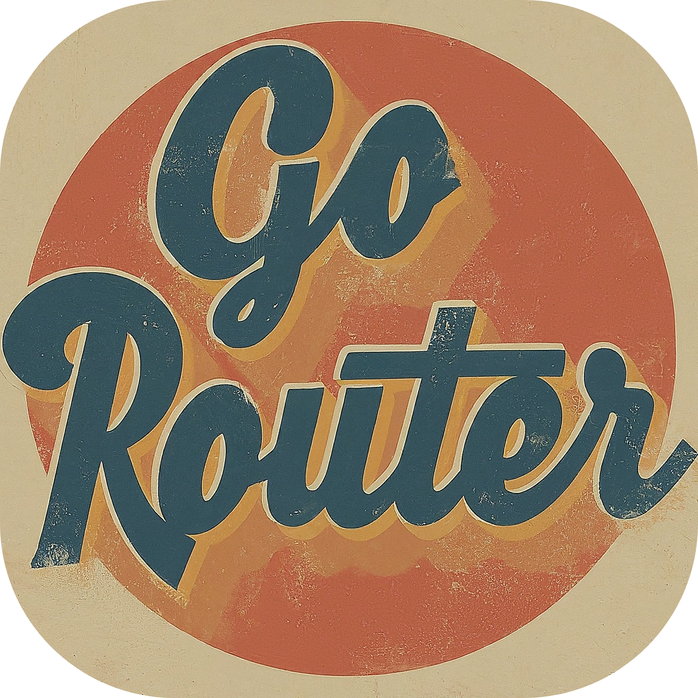
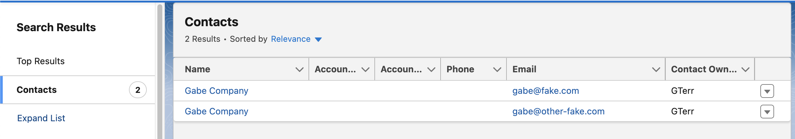
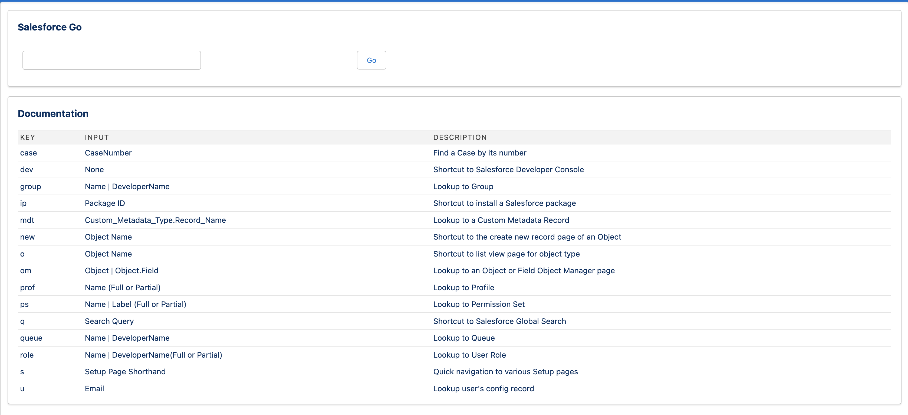
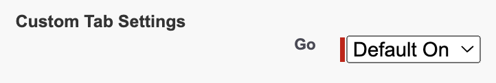
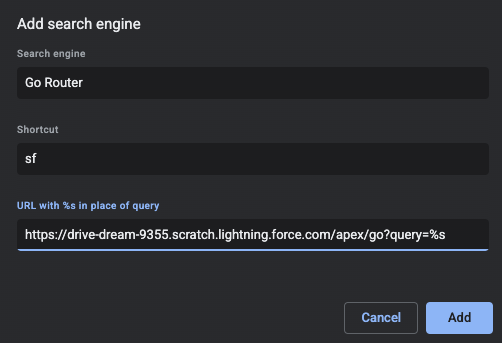
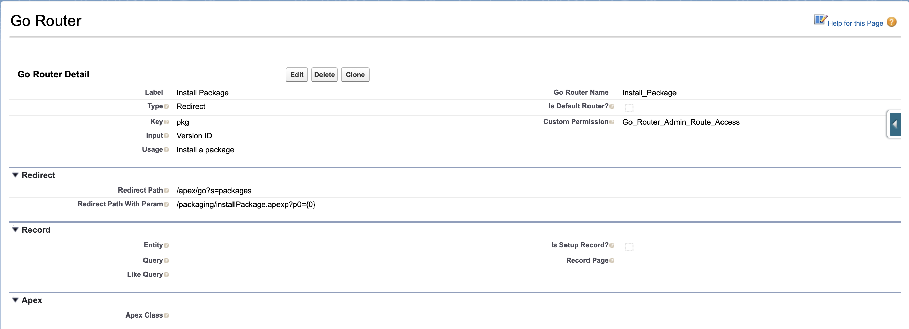
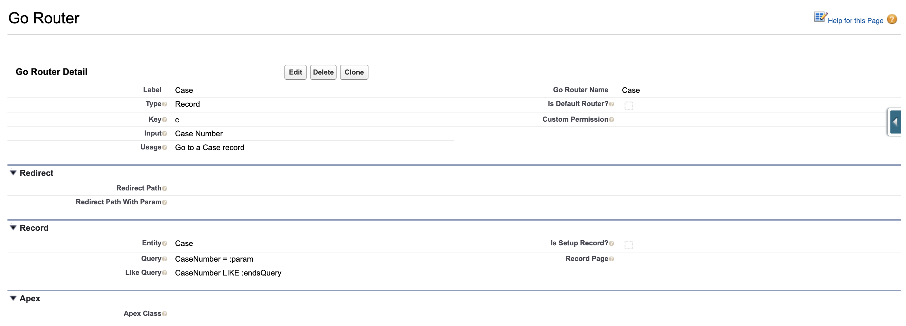
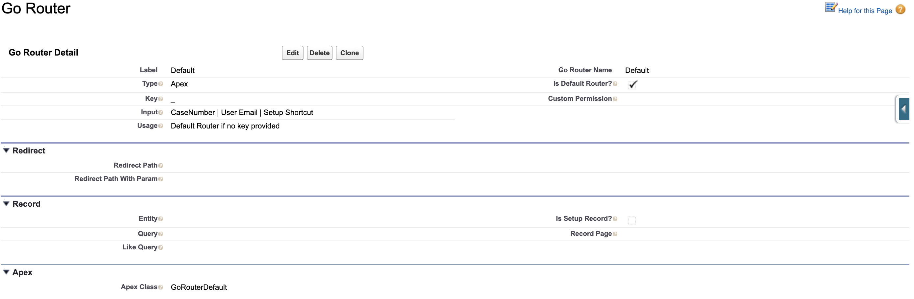
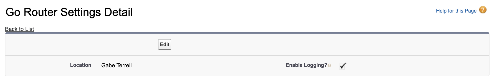
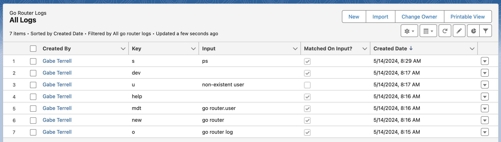

# Salesforce Go!



Do you find clicking around Salesforce to be slow and tedious? **Imagine if you could get to **_any_** page or record with only a few words in your browser!** Go Router's mission is to make that possible! Configure shortcuts to:

- Search for records using commonly identifiable fields
- Perform common quick operations for objects such as list or new
- Jump to any page in the setup menu or the developer console
- Navigate to any commonly used custom page or tab in your org
- Intelligently navigate to startup objects when given their IDs

Simply type the command into your browser:


and instantly jump to the page!


Or search for a particular type of record:


and jump to the matching record!


or if no exact match is found, immediately land on an **_object-scoped search_** for your query:



The Go Router Framework allows admins and developers to quickly and
easily build routes straight from the setup menu for any use case in their instance. Routes are designed to be self-documenting, and can be tied to custom-permissions to ensure that only the proper users in your organization have access to each route. Quickly access all self-accessible routes using the `help` route:




# Quick Start

## Install

<a href="https://githubsfdeploy.herokuapp.com?owner=gabe-terrell&amp;repo=go-router">
  
</a>


[Unlocked Package Installation (Production)](https://login.salesforce.com/packaging/installPackage.apexp?p0=)

[Unlocked Package Installation (Sandbox)](https://test.salesforce.com/packaging/installPackage.apexp?p0=)

> [!WARNING]
> When installing the package, there is a custom permission, `Go_Router_Admin_Route_Access`, that may be auto-assigned to profiles that the package is installed for. This custom permission grants access to admin-specific routes such as Developer Console or Profile search. As such, it is recommended to "install for admins only" or "install for specific profiles" in order to ensure that only those profiles get access to the admin-specific routes. Afterwards, it is easy to enable access to other users through either the provided `Go Router - Basic Access` permission set or manually enabling access to the `go` tab:
>
> 
>
> To manually provide access to admin/developer routes, use the `	Go Router - Admin/Developer Access` permission set.


## Setting up a Chrome Search Engine

To create a custom search engine to quickly navigate to an instance with only a
few keystrokes in the omnibar, do the following:

1.  Open up a new tab and go to
    [manage search engines settings](chrome://settings/searchEngines)
2.  Navigate to the `Site search` section, and click the `add` button.
3.  Create the new search engine with the following parameters:

    1.  Search Engine: The name for the engine, as will appear in the omnibar

    2.  Shortcut: The shorthand to enable the search. For example, if the
        shortcut is `sf`, then typing `sf` followed by a space in the omnibar
        will invoke a search.

    3.  URL: Should take the form of
        `https://{myinstance}.lightning.force.com/apex/go?query=%s`



## Verify everything is working

Try typing your shortcut and "help" into the omnibar to verify everything is working! For example, if your shortcut was `sf`, type in `sf help`, and you should land on the `Salesforce Go` page within your Salesforce instance!

### Why Does This Work?

Go Router was designed so that a route can be expressed in three different
formats:

-   `/apex/go?key=input`
-   `/apex/go?query=key+input`
-   `/apex/go?query=key/input`

Since Chrome will URL encode spaces, typing in `sf key input` will invoke the
search engine shorthand and result in the URL becoming
`/apex/go?query=key+input`.

# Creating Routers

Once Go Router is installed, use Go Router to quickly navigate to the creation page!


Each route is defined by a corresponding `Go_Router__mdt` record. The following
fields are used to define behavior for all routers:

| Field              | Usage                                                   |
| ------------------ | ------------------------------------------------------- |
| Type               | The type of router: Redirect, Record, Apex. See more below.      |
| Key                | The key used to use this route (e.g. `/apex/go?{key}={input}`).                      |
| Input              | A String explaining what input to send to this router. Used for the help page only.       |
| Usage              | A String explaining what the router does. Used for the help page only.              |
| Is Default Router? | If checked, this router will be used when no key is matched from a query. (e.g. `/apex/go?query={input}`)  |
| Group              | An optional string specifying which "group" of routers this belongs to. On the help page, routes are organized by group for easier documenting.  |
| Custom Permission  | API Name of a Custom Permission. If set, the user must have this custom permission to see and use the route.  |

## Redirect Routers

Redirect routers are used to route to a relative URL within Salesforce. The
route can optionally be modified based on input being passed in or not:

| Field                    | Usage                                      |
| ------------------------ | ------------------------------------------ |
| Redirect Path            | The relative URL to redirect to            |
| Redirect Path With Param | If input is provided, redirect to this URL instead. Pass in the param using `{0}` |

Here is an example to setup a router that makes it easy to install Salesforce packages. If a package ID is passed in, the route will redirect to
the installation URL. If no input is passed in, it will instead redirect to the
setup page listing all installed packages.




## Record Routers

Redirect routers are used to route to a record based on a unique value. A SOQL
query will be defined based on the config, and if the query returns exactly **one**
result, it will route to the corresponding record page. To add more flexibility
to the search, two queries can be defined: a specific query and a broader "like"
query. If the specific query fails, the broader query will be performed as a
second chance to match on the input. If both fail, it will redirect to the
Salesforce search page, scoping the query to the specific object (this even
works for setup objects!).

| Field            | Usage                                                     |
| ---------------- | --------------------------------------------------------- |
| Entity           | The API Name of the SObject being queried.                |
| Query            | The `WHERE` clause defining the query.                      |
| Like Query       | The `WHERE` clause defining the optional broader query. It's usually expected to use a `LIKE` clause if used.    |
| Is Setup Record? | If checked, denotes the SObject as being a Setup Object (e.g. Group, Role, etc.). This is used for rerouting to the record page and for scoping search.    |
| Record Page      | If checked, overrides the URL to navigate to upon finding a matching record. Pass in the ID using `{0}`.  |

Here is an example to setup a router that queries for a Case using CaseNumber.
This is helpful since a lot of references to a Case are by using the CaseNumber
instead of the ID. Using the Like Query, the query can also search for a
CaseNumber where the leading zeros have been removed.



## Apex Routers

For routers requiring more complex logic, an Apex class that extends
GoRouter
can be created. The class simply needs to extend the `String route(String param)` method and return a relative URL to the page it should route to. 

An example of a simple use case is defining a router for
handling the default router of an instance. That is, define the logic for a "key-less" route. This can involve sending the input
to a couple of common use cases and falling back to search. Take the following
example:

```java
public with sharing class GoRouterDefault extends GoRouter {
    // Search for Case by CaseNumber, User by Email, or setup menu shorthands.
    // These are the most common needs of users of this instance.
    private static final Set<String> ROUTES = new Set<String>{'case', 'u', 's'};
        
    public override String route(String param) {
        // If a user does not have access to the setup route, it will not be returned!
        List<GoRouter> routers = GoRouter.forKeys(ROUTES);
        // If any router found a match, super.matchedOnInput will update to true.
        String result = super.delegateTo(param, routers);
        // Fallback to global search if no match.
        return super.matchedOnInput ? result : new GoRouterSearch().route(param);
    }
}
```

Then define the router definition to bind it to the Apex class. Be sure to check `Is Default Router?`. It is typically recommended to set the key as `_` for the default router:



# Logging

Out of the box, Go Router provides functionality for tracking usages of routers. This allows for admins to understand how much usage the package is getting, which routes provide the most value, and learn when users are having issues with routers not matching on the expected input.

**By default, logging is disabled to preserve database space in your org!**

To enable logging, go to the custom settings page and `enable logging` for designated profiles or users:




Then assign yourself the `Go Router - View All Logs` permission set. Then you can verify logs are being captured by navigating to the object listing page:


